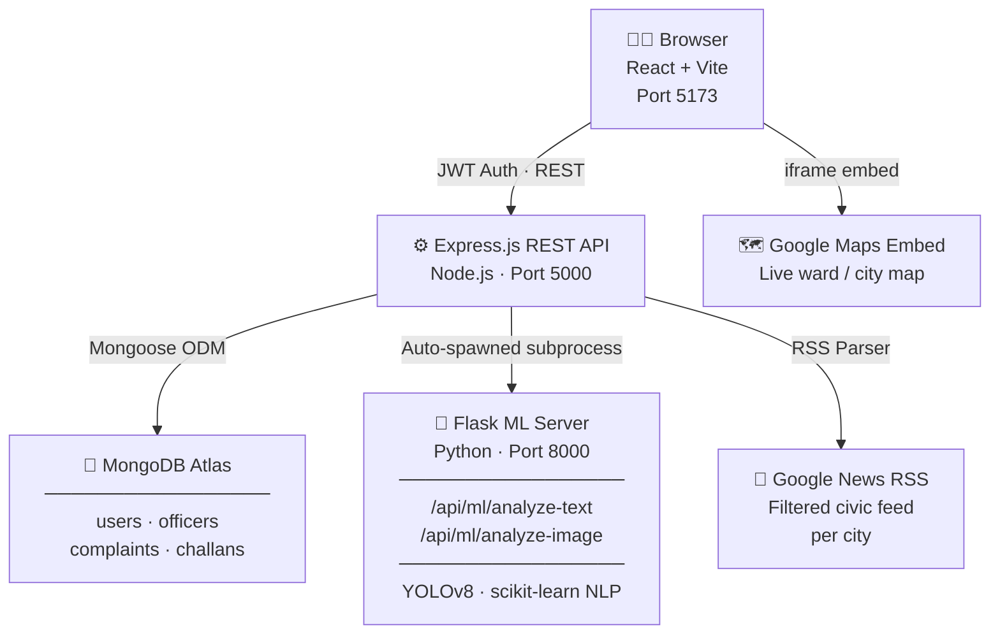
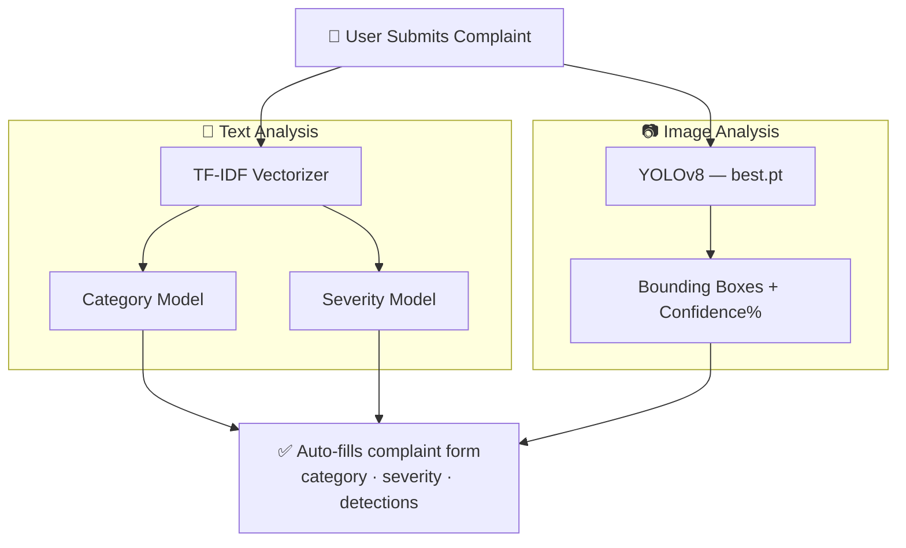
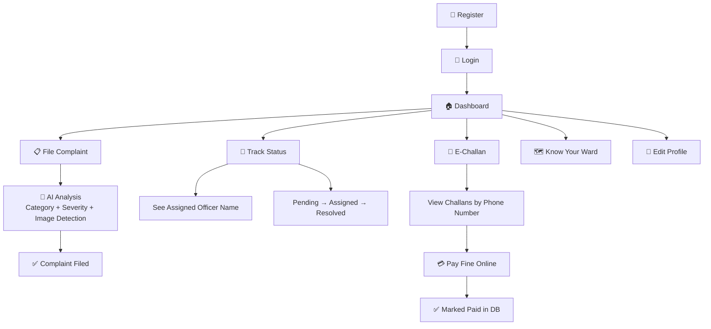
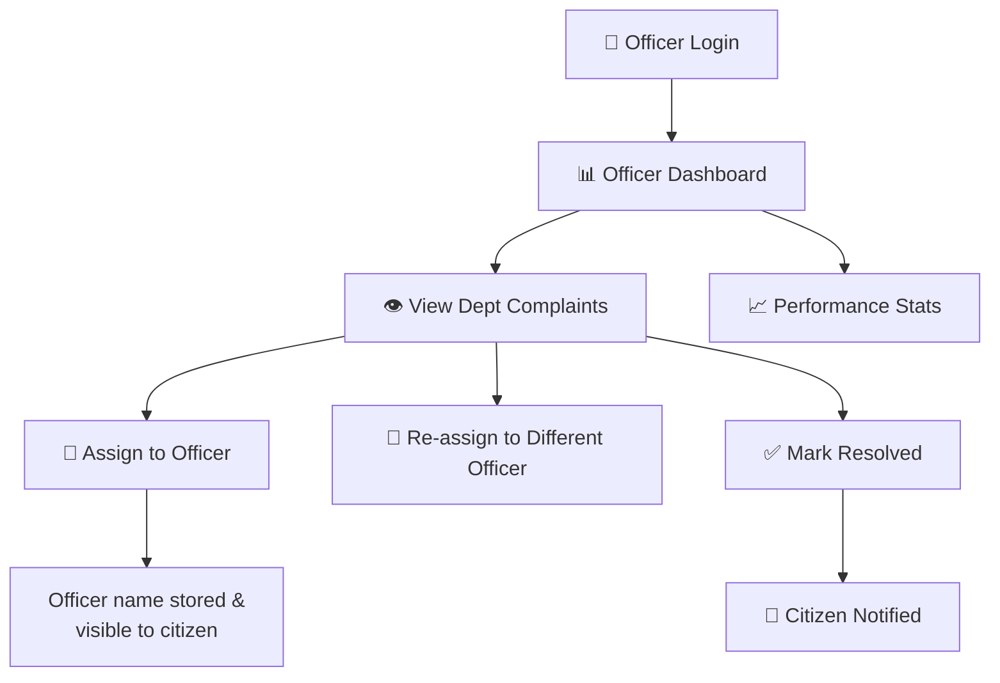
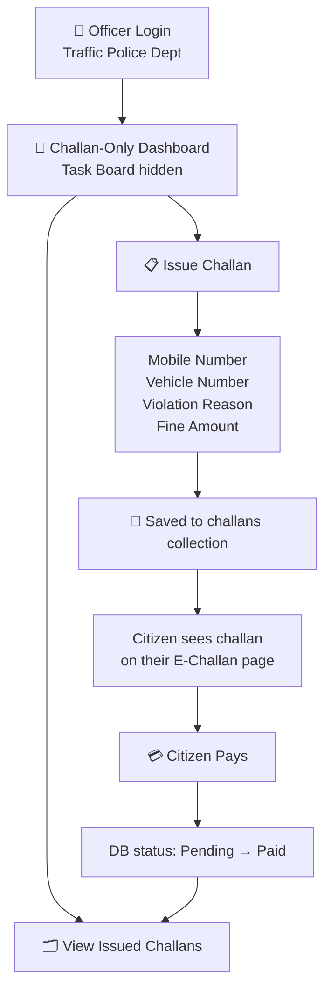
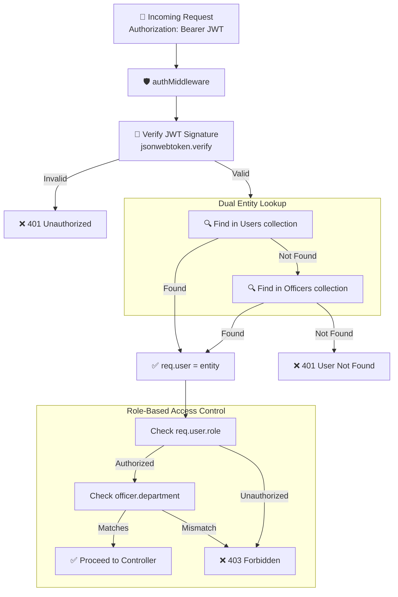

<div align="center">
    
# IMPACT
### Intelligent Municipal Action & City Triage

[](https://nodejs.org/)
[](https://react.dev/)
[](https://www.mongodb.com/atlas)
[](https://www.python.org/)
[](https://flask.palletsprojects.com/)
[](https://tailwindcss.com/)
[](./LICENSE)

> **A full-stack, AI-augmented civic complaint management platform connecting citizens with their municipal government in real time.**

[📖 Documentation](#-api-reference) • [🐛 Report Bug](https://github.com/TaherBatterywala/IMPACT-Intelligent-Municipal-Action-City-Triage/issues)

</div>

---

## 📋 Table of Contents

1. [Overview](#-overview)
2. [Key Features](#-key-features)
3. [System Architecture](#-system-architecture)
4. [Tech Stack](#-tech-stack)
5. [Database Design](#-database-design)
6. [AI / ML Integration](#-ai--ml-integration)
7. [User Journeys](#-user-journeys)
8. [API Reference](#-api-reference)
9. [Project Structure](#-project-structure)
10. [Environment Variables](#-environment-variables)
11. [Getting Started](#-getting-started)
12. [Security Model](#-security-model)

---

## 🌟 Overview

**IMPACT** (Intelligent Municipal Action & City Triage) is a production-grade MERN-stack civic platform engineered to comprehensively digitize the entire municipal grievance lifecycle. Built as an **EPICS** academic project, it goes far beyond a typical complaint form — integrating AI-driven triage, computer vision garbage detection, real-time E-Challan management for traffic police, live hyper-local news, Google Maps ward integration, and multi-role authenticated dashboards.

The platform serves **three distinct user roles** with completely isolated, role-appropriate experiences:

| Role | Portal | Capabilities |
|---|---|---|
| 🏙️ **Citizen** | User Dashboard | File complaints, track status, view challans, Know Your Ward |
| 🏛️ **Municipal Officer** | Officer Dashboard | Manage complaints, assign tasks, resolve grievances |
| 🚦 **Traffic Police** | Challan Portal | Issue E-Challans, track payment status |

---

## ✨ Key Features

### 🧑‍💻 Citizen Portal
- **Smart Complaint Filing** — Rich form with photo evidence upload, voice-to-text dictation, and auto-detection of complaint category & severity via AI
- **Real-Time Status Tracking** — End-to-end lifecycle visibility from `Pending → Assigned → In Progress → Resolved` with assigned officer name displayed
- **E-Challan Management** — Citizens automatically see all traffic challans linked to their registered phone number; pay via simulated UPI/Bank gateway
- **Know Your Ward** — Dynamic ward directory showing Ward Number, City, elected Corporator info, and a live interactive Google Maps embed centered on the citizen's registered location
- **Live Civic News Feed** — Automatically filtered Google News RSS fetching only municipal/civic stories (Nagar Nigam, infrastructure, roads, sanitation) for the citizen's city
- **Profile Management** — Full inline profile editing (name, email, phone, city, ward, password) with secure bcrypt hashing persisted to MongoDB
- **Bus Tickets** — Quick-access transit ticketing section
- **Emergency Services** — One-tap access to emergency contacts

### 🏛️ Officer Portal
- **Unified Task Board** — All complaints filtered by officer department appear in one organized board
- **Smart Assignment** — Officers can assign any complaint to a specific colleague with the officer's name stored and surfaced to citizens
- **Re-assignment** — Main officers can switch a complaint's assigned officer at any time
- **One-click Resolution** with confirmation popup before marking resolved
- **Department Isolation** — Officers only see complaints matching their department (Water, Roads, Sanitation, Electricity, etc.)
- **Traffic Police Lock** — Officers with the `Traffic Police` department see **only** the E-Challan interface; the task board is hidden

### 🚦 Traffic Police (E-Challan)
- **Issue Challans** — Input citizen mobile number, vehicle number, violation reason (No Helmet, Red Light, No License, Speeding, etc.) and fine amount
- **Challan History** — Full ledger of challans issued by the logged-in officer with real-time payment status
- **Database-backed** — All challans stored in a dedicated `challans` MongoDB collection

### 🤖 AI / ML Features
- **NLP Text Analysis** — scikit-learn TF-IDF + classifier models auto-detect complaint **category** and **severity** from the description text
- **Computer Vision** — YOLOv8 model (`best (1).pt`) detects garbage/waste in uploaded photos, providing bounding box confidence scores
- **Auto-start** — Python Flask ML server spawns automatically when the Node.js backend starts; no manual effort required

---

## 🏛 System Architecture



The system follows a clean **MVC** pattern:
- **Models** — Mongoose schemas (`User`, `Officer`, `Complaint`, `Challan`)
- **Controllers** — Business logic per domain (`authController`, `complaintController`, `officerController`, `challanController`, `newsController`, `userController`)
- **Routes** — RESTful Express routers per resource
- **Middleware** — JWT auth + role-based access control protecting every private route

---

## 💻 Tech Stack

### Frontend
| Technology | Version | Purpose |
|---|---|---|
| React | 19.x | UI framework |
| Vite | 7.x | Build tool & dev server |
| Tailwind CSS | 4.x | Utility-first styling |
| Framer Motion | 12.x | Animations & transitions |
| React Router | 7.x | Client-side routing |
| Axios | 1.x | HTTP client |
| React Icons | 5.x | Icon library |
| SweetAlert2 | 11.x | Premium modal dialogs |

### Backend
| Technology | Version | Purpose |
|---|---|---|
| Node.js | 22.x | Runtime |
| Express.js | 5.x | Web framework |
| Mongoose | 9.x | MongoDB ODM |
| JSON Web Token | 9.x | Authentication |
| bcryptjs | 3.x | Password hashing |
| RSS Parser | 3.x | Google News RSS feed |
| dotenv | 17.x | Environment config |
| cors | 2.x | Cross-origin requests |

### ML Server
| Technology | Version | Purpose |
|---|---|---|
| Python | 3.11 | Runtime |
| Flask | 3.x | Micro web framework |
| flask-cors | 5.x | CORS for Flask |
| ultralytics (YOLOv8) | 8.x | Garbage image detection |
| scikit-learn | 1.x | NLP text classification |
| joblib | 1.x | Model serialization |
| Pillow | 11.x | Image processing |

### Database & Infrastructure
| Service | Purpose |
|---|---|
| MongoDB Atlas | Cloud-hosted NoSQL database |
| Google News RSS | Live civic news feed |
| Google Maps Embed | Live ward/city maps |

---

## 🗄 Database Design

### Collections Overview

```
MongoDB Atlas — epics_project database
├── users         → Citizen profiles & auth
├── officers      → Municipal staff profiles
├── complaints    → Civic grievance records
└── challans      → Traffic violation records
```

### `users` Schema
```js
{
  name:        String (required),
  email:       String (required, unique),
  phone:       String (required, unique),  // used to link E-Challans
  password:    String (bcrypt hashed),
  city:        String,
  wardNumber:  Number,
  role:        String ("citizen"),
  notifications: [{ message, read, createdAt }],
  timestamps:  true
}
```

### `officers` Schema
```js
{
  name:        String (required),
  officerId:   String (required, unique),  // badge / login username
  password:    String (bcrypt hashed),
  department:  String (required),          // "Traffic Police", "Water", "Roads"...
  role:        String ("officer"),
  timestamps:  true
}
```

### `complaints` Schema
```js
{
  userId:      ObjectId → User,
  title:       String,
  description: String,
  category:    String (enum),              // AI auto-detected
  priority:    String (enum: High/Med/Low),// AI auto-detected
  status:      String (enum: Pending/Assigned/In Progress/Resolved),
  assignedTo:  String,                     // officer name
  image:       String (base64),
  location:    String,
  timestamps:  true
}
```

### `challans` Schema
```js
{
  mobileNumber:  String (required),   // matched to user phone
  vehicleNumber: String (required),
  reason:        String (required),   // "No Helmet", "Red Light", etc.
  amount:        Number (required),
  status:        String ("Pending" | "Paid"),
  issuedBy:      ObjectId → Officer,
  timestamps:    true
}
```

---

## 🤖 AI / ML Integration

### Architecture



### Endpoints (Flask — Port 8000)

| Method | Endpoint | Input | Output |
|---|---|---|---|
| POST | `/api/ml/analyze-text` | `{ text: string }` | `{ category, severity }` |
| POST | `/api/ml/analyze-image` | `{ image: base64 }` | `{ detections[], summary }` |

### Auto-Start
The Flask ML server **starts automatically** when the Node.js server boots — no separate terminal needed:

```js
// server/server.js
const mlServer = spawn(`"${venvPython}"`, ['app.py'], { cwd: mlDir, shell: true });
```

---

## 👥 User Journeys

### 🏙️ Citizen Journey



### 🏛️ Officer Journey



### 🚦 Traffic Police Journey



---

## 📖 API Reference

### Authentication — `/api/auth`

| Method | Endpoint | Access | Body | Description |
|---|---|---|---|---|
| POST | `/register` | Public | `{name, email, phone, password, city, wardNumber}` | Register citizen |
| POST | `/login` | Public | `{phone, password}` | Citizen login |
| POST | `/officer/login` | Public | `{officerId, password}` | Officer login |
| POST | `/officer/register` | Public | `{name, officerId, password, department}` | Create officer |

### Users — `/api/users`

| Method | Endpoint | Access | Description |
|---|---|---|---|
| GET | `/me` | 🔒 Citizen | Get own profile |
| PUT | `/profile` | 🔒 Citizen | Update profile (incl. password) |

### Complaints — `/api/complaints`

| Method | Endpoint | Access | Description |
|---|---|---|---|
| POST | `/` | 🔒 Citizen | File new complaint |
| GET | `/my` | 🔒 Citizen | Get own complaints |
| GET | `/officer` | 🔒 Officer | Get dept complaints |
| PUT | `/assign/:id` | 🔒 Officer | Assign complaint |
| PUT | `/resolve/:id` | 🔒 Officer | Resolve complaint |

### E-Challans — `/api/challans`

| Method | Endpoint | Access | Description |
|---|---|---|---|
| POST | `/` | 🔒 Officer | Issue new challan |
| GET | `/officer` | 🔒 Officer | Get issued challan history |
| GET | `/my` | 🔒 Citizen | Get personal challans by phone |
| PUT | `/:id/pay` | 🔒 Citizen | Mark challan as Paid |

### News — `/api/news`

| Method | Endpoint | Access | Description |
|---|---|---|---|
| GET | `/:city` | Public | Get filtered municipal news for city |

---

## 📁 Project Structure

```
Epics Copy/
├── .gitignore                  # Comprehensive ignore rules
├── .env.example                # Environment variable template
├── package.json                # Root — concurrently runs client + server
├── requirements.txt            # Python dependencies for ML server
│
├── client/                     # React + Vite frontend
│   ├── src/
│   │   ├── components/
│   │   │   ├── common/         # Navbar, Input, Button, LanguageSwitcher
│   │   │   └── user/           # NewsSlider, ComplaintCard...
│   │   ├── context/
│   │   │   └── AuthContext.jsx # Global auth state + updateUser
│   │   ├── pages/
│   │   │   ├── auth/           # Login, Register, OfficerLogin
│   │   │   ├── user/           # Dashboard, FileComplaint, TrackStatus,
│   │   │   │                   # TrafficChallan, KnowYourWard, UserProfile,
│   │   │   │                   # BusTickets, Emergency
│   │   │   └── officer/        # OfficerDashboard (incl. ChallanManagement)
│   │   └── services/
│   │       └── api.js          # Axios instance with auth header injection
│   ├── index.css               # Tailwind base + design tokens
│   └── vite.config.js
│
├── server/                     # Express.js backend
│   ├── .env                    # ⛔ NOT committed (see .env.example)
│   ├── server.js               # Entry point + ML server auto-spawn
│   ├── config/
│   │   └── db.js               # MongoDB Atlas connection
│   ├── controllers/            # authController, complaintController,
│   │                           # officerController, challanController,
│   │                           # newsController, userController
│   ├── middleware/
│   │   └── authMiddleware.js   # JWT verify + dual user/officer lookup
│   ├── models/                 # User, Officer, Complaint, Challan
│   └── routes/                 # authRoutes, userRoutes, complaintRoutes,
│                               # officerRoutes, challanRoutes, newsRoutes
│
├── ml-server/
│   └── app.py                  # Flask API — text + image ML endpoints
│
├── ML Model/
│   ├── best (1).pt             # YOLOv8 trained garbage detection weights
│   ├── category_model.pkl      # NLP complaint category classifier
│   ├── severity_model.pkl      # NLP severity classifier
│   ├── tfidf_vectorizer.pkl    # TF-IDF vectorizer
│   ├── EPICS.ipynb             # YOLOv8 training notebook
│   └── nlp.ipynb               # NLP training notebook
│
└── venv/                       # ⛔ Python venv (NOT committed)
```

---

## 🔐 Environment Variables

Create `server/.env` by copying `server/.env.example`:

```env
PORT=5000

# MongoDB Atlas connection string
MONGO_URI=mongodb+srv://<username>:<password>@cluster0.xxxxx.mongodb.net/<dbname>?retryWrites=true&w=majority

# JWT signing secret — use a long random string in production
JWT_SECRET=replace_with_a_strong_random_secret
```

> ⚠️ **Never commit your real `.env` file.** It contains your MongoDB credentials and JWT secret.

---

## 🚀 Getting Started

### Prerequisites
- **Node.js** ≥ 16
- **Python** ≥ 3.9
- **MongoDB Atlas** account (or local MongoDB)
- A virtual environment configured with `requirements.txt`

### 1. Clone the Repository
```bash
git clone https://github.com/TaherBatterywala/IMPACT-Intelligent-Municipal-Action-City-Triage.git
cd "IMPACT-Intelligent-Municipal-Action-City-Triage"
```

### 2. Install All Dependencies
```bash
# Install root, server, and client node packages in one shot
npm run install-all
```

### 3. Create Environment File
```bash
cp server/.env.example server/.env
# Then open server/.env and fill in your MONGO_URI and JWT_SECRET
```

### 4. Set Up Python Virtual Environment
```bash
python -m venv venv

# Windows:
venv\Scripts\activate
# macOS/Linux:
source venv/bin/activate

pip install -r requirements.txt
```

### 5. Run the Full Stack
```bash
# From the root directory — starts Node server + React client together
npm run dev
```
The Node server auto-spawns the Flask ML API on startup. No separate Python command needed.

| Service | URL |
|---|---|
| React Frontend | http://localhost:5173 |
| Express Backend | http://localhost:5000 |
| Flask ML API | http://localhost:8000 |

---

## 🔐 Security Model

### Authentication Flow



### Security Measures
- **Bcrypt password hashing** with 10 salt rounds on all passwords (citizens & officers)
- **JWT tokens** — signed with a server-side secret, verified on every protected route
- **Role isolation** — Citizens cannot access officer endpoints and vice versa
- **Department isolation** — Officers only see complaints for their own department
- **Traffic Police restriction** — `Traffic Police` officers are locked to the challan-only UI at the router level
- **No self-registration for officers** — Officers must be created through a protected admin/seed route
- **Sensitive files excluded from Git** — `.env` with DB credentials and JWT secret is gitignored


## 👨‍💻 Authors

**IMPACT Team** — Built as an EPICS Academic Project

---

<div align="center">

*Bridging Citizens & Municipal Government — One Complaint at a Time*

</div>
